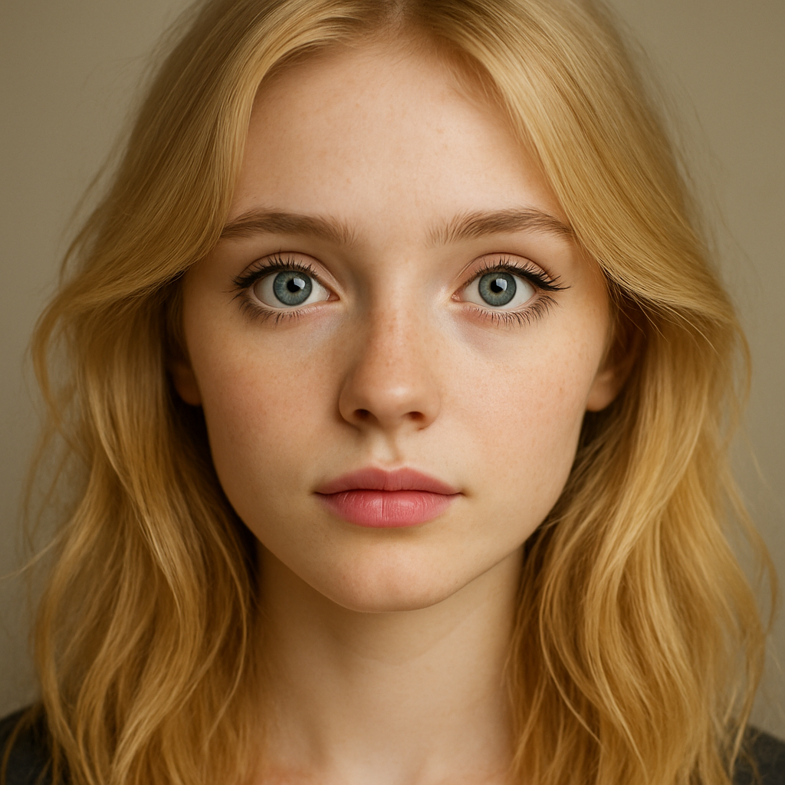
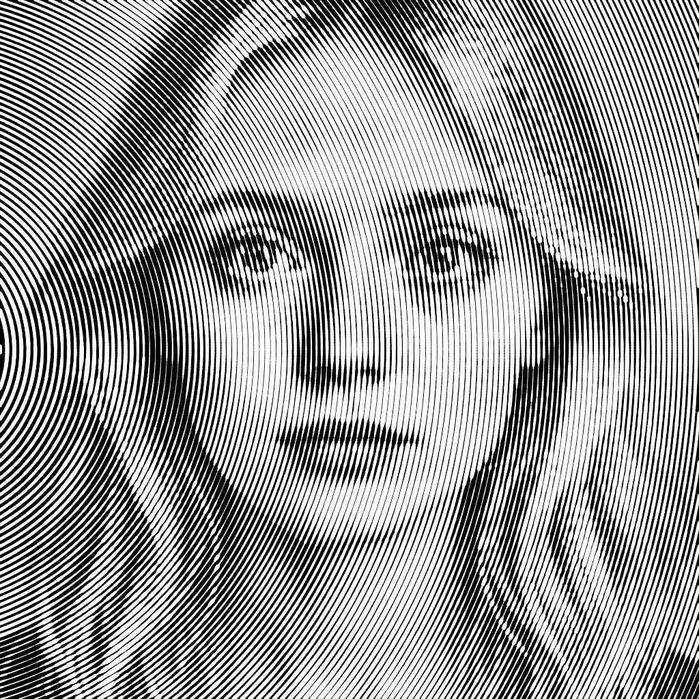

# polarhalftone

**polarhalftone** is a Python toolchain that converts bitmap images into *circular halftone line art*, then optimizes the resulting SVGs for *PrusaSlicer*, *laser engraving*, or *plotter* workflows.
It works by sampling brightness in polar coordinates, generating a ring-based halftone pattern that preserves tonal variation while producing clean, slice-ready vector geometry.

 

## ✦ Features
- 🌀 **Polar Halftone Generation**
  - Converts grayscale or color images into ring-based halftone structures.
  - Adjustable number of rings, line thickness scaling, and tonal mapping.
- ⚙️ **PrusaSlicer-Safe SVG Output**
  - Removes malformed or anomalous path segments.
  - Splits long paths to avoid rendering or slicing issues.
  - Preserves all original SVG attributes and numeric precision.
- 🎨 **High-Fidelity Vector Output**
  - Floating-point coordinates (6-decimal precision).
  - Consistent stroke geometry suitable for engraving or plotting.
- 🧩 **CLI-Friendly**
  - Command-line arguments for full control of thresholds, scaling, and verbosity.

## 🔧 Installation
Clone the repository and install dependencies:
```bash
git clone https://github.com/yourusername/polarhalftone.git
cd polarhalftone
pip install -r requirements.txt
```

## Quick start
Preview in Inkscape
```bash
python polarhalftone.py input.png --center_x -150 --clean
```

Export a preview PNG (optional)
```bash
inkscape "$(ls -t *.svg | head -n 1)" --export-type=png
```

Generate PrusaSlicer-ready SVG
```bash
python polarhalftone.py input.png --center_x -150 --clean --print
```

## CLI Options

| Flag | Description | Default |
|------|-------------|---------|
| `-h, --help` | Show this help message and exit | – |
| `--output OUTPUT` | Output SVG filename (e.g., `output.svg`) | Auto-generated from input |
| `--N N` | Total number of concentric rings | *(code-defined)* |
| `--base_N BASE_N` | Base ring count before scaling | *(code-defined)* |
| `--min_thick MIN_THICK` | Minimum stroke thickness (px) | *(code-defined)* |
| `--max_thick MAX_THICK` | Maximum stroke thickness (px) | *(code-defined)* |
| `--epsilon EPSILON` | Path simplification tolerance (Douglas-Peucker) | *(code-defined)* |
| `--center_x CENTER_X` | X-offset of halftone center from image center (px) | `0` |
| `--center_y CENTER_Y` | Y-offset of halftone center from image center (px) | `0` |
| `--base_arc_len BASE_ARC_LEN` | Base arc length per ring segment | *(code-defined)* |
| `--stroke_tolerance STROKE_TOLERANCE` | Tolerance for merging nearby strokes | *(code-defined)* |
| `--verbose` | Enable verbose logging | *off* |
| `--no-progress` | Disable progress bar | *off* |
| `--no-minify` | Preserve full floating-point precision in SVG | *off* |
| `--print` | Optimize SVG for PrusaSlicer (split long paths, clean geometry) | *off* |
| `--clean` | Remove malformed or excessively long path segments | *off* |
| `--threshold THRESHOLD` | Max segment length (px) when `--clean` is enabled | `500` |
| `input` | Input image file (PNG, JPG, etc.) — **required positional argument** | – |

---

### Notes:
- **`--threshold`**: Only applies when `--clean` is active. Controls the maximum allowed length of any single path segment before it's split or removed.
- **Default values**: Replace `*(code-defined)*` with actual defaults from your script (e.g., check `argparse` defaults).
